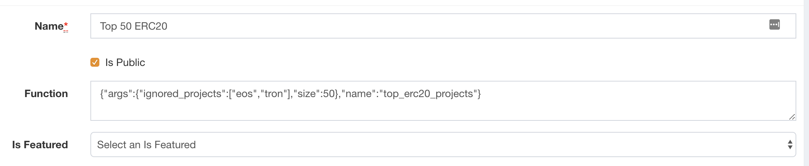

## Table of contents

- [Table of contents](#table-of-contents)
  - [Overview](#overview)
  - [Example Usage](#example-usage)
  - [Top ERC20 projects](#top-erc20-projects)
  - [Top all projects](#top-all-projects)
  - [Market Segment](#market-segment)
  - [Min Volume](#min-volume)
  - [Slugs](#slugs)

### Overview

There are some cases where a list of projects can nicely be expressed programatically.
One such case is having the list of `Top 50 ERC20 Projects` and not having to update it manually.

### Example Usage

Example usage of creatig a dynamic watchlist via the GraphQL API:

```
mutation {
  createUserList(
    name: "Top 50 ERC20 Projects",
    color: BLACK, isPublic: true,
    function: "{\"name\":\"top_erc20_projects\", \"args\":{\"size\":50}}") {
      listItems {
        project {
          slug
        }
    }
  }
}
```

There's also the posibility of manually changing the function through the ExAdmin.
Editing a watchlist through the panel opens this panel:


The function can also be edited through it.

### Top ERC20 Projects

A function that returns the top `size` ERC20 projects. The function is identified with by the name `top_erc20_projects` and accepts two arugments:

- size (required) - The number of projects in the list, sorted by marketcap. Applied after the `ignored_projects` filter.
- ignored_projects (optional) - A list of projects that are going to be excluded.

```
{
  "name":"top_erc20_projects",
  "args":{
    "size":50,
    "ignored_projects": ["tron", "eos"]
  }
}
```

### Top all Projects

A function that returns the top `size` projects. The function is identified with by the name `top_all_projects` and accepts one arugment:

- size (required) - The number of projects in the list, sorted by marketcap. Applied after the `ignored_projects` filter.

```
{
  "name":"top_all_projects",
  "args":{
    "size":100
  }
}
```

### Market Segment

A function that returns all projects with a given market segment. The function is identified with by the name `market_segments` and accepts one arugment:

- market_segment (required) - A string or list of strings representing market segments. If list is provided, the list will contain all projects that have at least one of the provided market segments.

```
{
  "name":"market_segment",
  "args":{
    "market_segment": "stablecoin"
  }
}
```

```
{
  "name":"market_segment",
  "args":{
    "market_segment": ["exchannge", "stablecoin"]
  }
}
```

### Min Volume

A function that returns all projects with trading volume over a given threshold. The function is identified with by the name `min_volume` and accepts one arugment:

- min_volume (required) - A number representing the minimal trading threhsold.

```
{
  "name":"min_volume",
  "args":{
    "min_volume": 100000000
  }
}
```

### Slugs

A function that returns all projects with a given slug. The function is identified with by the name `slugs` and accepts one arugment:

- slugs (required) - A list of slugs

```
{
  "name":"slugs",
  "args":{
    "slugs": ["bitcoin", "ethereum", "ripple", "santiment", "maker"]
  }
}
```
