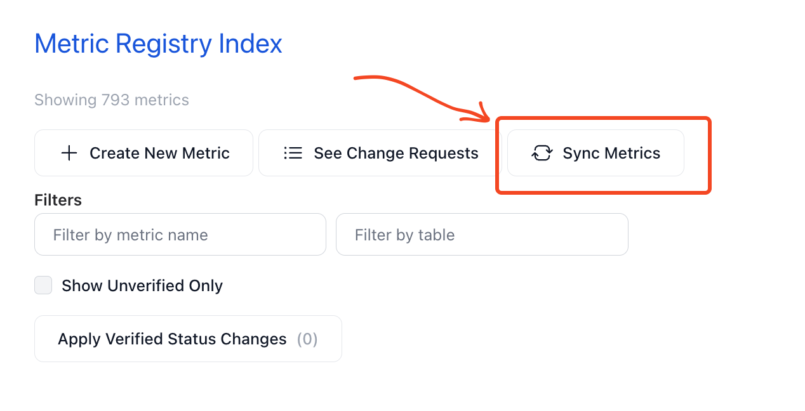
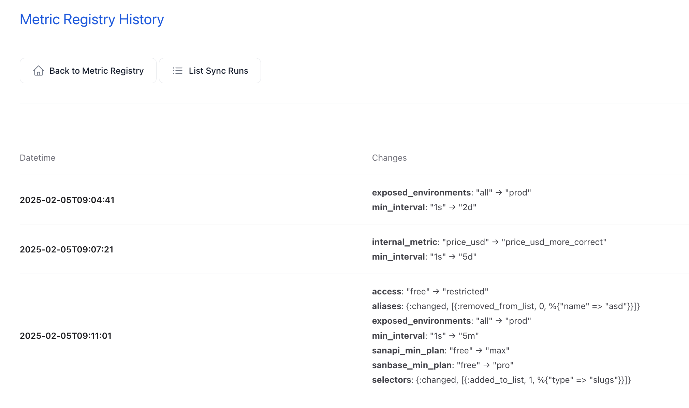

# Metric Registry

The Metric Registry is our tool for managing what metrics are exposed in our API and how.
This document will guide you how to use the Web interface to add/edit metrics, how to sync your changes between stage and prod and more.

---

## Location

The Metric Registry can be found on the following locations:

- stage: <http://sanbase-admin.stage.san:31080/admin/metric_registry>
- prod: <http://sanbase-admin.production.san:31080/admin/metric_registry>

---

## Difference between stage and production

The Metric Registry behaves differently in staging and production environments.
This reflects the way metrics are supposed to be tested and deployed.

- **Stage**: Metrics can only be created and edited on staging. After a metric is
  created/updated, it is put in a unverified and not synced status. After the
  changes are tested, the metric status can be changed to verified. Verified but
  not synced metrics can be synced to production.
- **Production**: No direct
  changes are allowed on production. This is done so stage and production can be
  kept in the exact same state.

## Metric Registry Index

On the index page the full list of metrics is shown.
The navigation buttons lead to other parts of the Metric Registry, explained below.
The filters are used to search for metrics.

---

## Creating a New Metric

To create a new metric, follow these steps:

1. Navigate to the Metrics Regitry Index page.
2. Choose how to create a metric:

- Click on the "Create New Metric" button located at the top left corner of the page to create a new metric from scratch
- Click on `Duplicate` button on a given metric row to create a new metric, but have all the fields pre-filled with the values
  from the metric being duplicated.

3. Fill/change the form on the page that you are redirected to.
4. Click "Submit Change Request" to create a change request.

---

## Editing an Existing Metric

To edit an existing metric:

1. Go to the Metric Registry Index page and locate the metric you wish to edit.

- You can locate it either by scrolling or by using the Filter by metric name input field

2. Click on the `Edit` button on the metric row
3. Update the fields as necessary.
4. Click "Submit Change Request" to create a change request.

The form is the same used for creating new metrics.

---

## Deleting a Metric

It is not possible to delete a metric record.
To restrict the access to the metric mark is deprecated and put a `Hard Deprecate After` date, after which the
metric will no longer be accessible.

If this is not acceptable, contact the backend team

## Change Requests

---

Changes to the metrics are not directly applied to the database table.
Instead, Change Request records are created. These change requests can be reviewed, approved, declined or undone.

If not in hurry, the person who submits the change request should ask someone else to review the changes in order to avoid mistakes.

When a change is approved, the changes are applied.
When a change is declined, nothing changes in the record.

NOTE: When an approved change is undone, the fields are reverted to the values that were stored **before** this change was applied.
Be careful with this action if multiple changes are approved & applied after the change you are currently trying to Undo.
The safest way is to submit a new change request.

---

## Sync Stage -> Prod

Changes to the Metric Registry are allowed only on Stage. When changes are applied, tested and verified, they can be
deployed to production. This way the state of stage and production is kept in sync, bar for the currently not synced changes.

All metrics get put into UNVERIFIED stage after chagnes are applied to them.

After the changes are tested and prooved to be good, click the toggle to change the status to VERIFIED (or change back to UNVERIFIED, if needed).
When some metric verified status are changed, you can click the `Apply Verified Status Changes` button, review the verification changes and confirm them.

Then, all the metrics that are VERIFIED but also NOT SYNCED (after their last change they have not been synced) are eligible for syncing.

To start the syncing process, click the `Sync Metrics` button:

Select all the metrics that you want to sync and click `Sync Metrics`:

You'll be redirected to a page listing all the past Sync Runs:

On staging you are going to see only `Outgoing` syncs and on production -- only `Incoming` syncs.
You can also view what exactly is the content of each sync by clicking on `Details`.

## Metric Changes History per Metric

On production you can also see all the changes that were applied via sync to a given metric.
