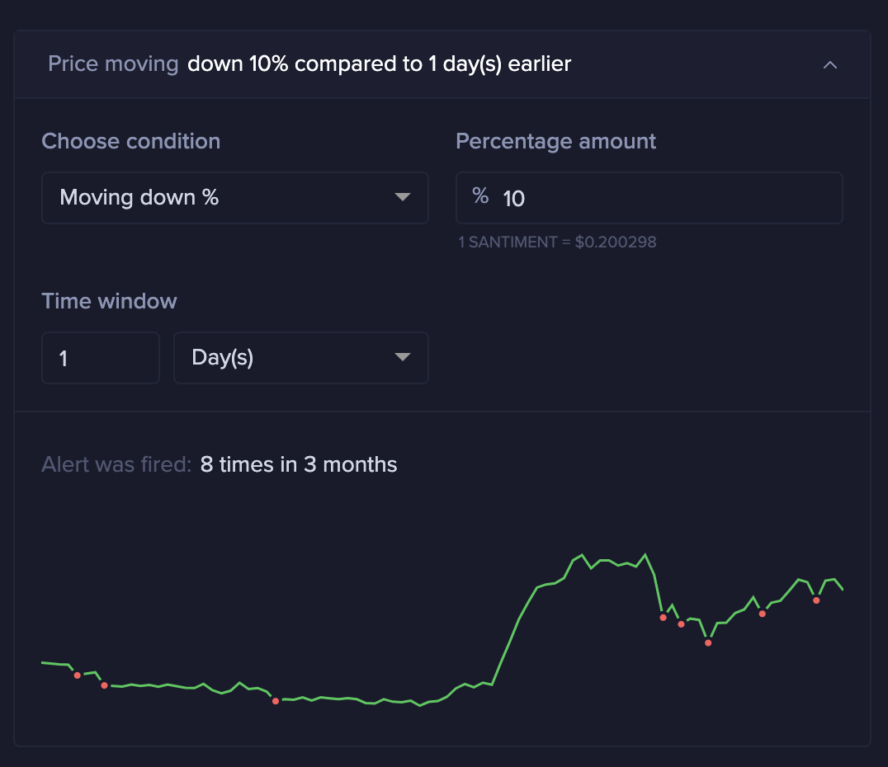

# Alerts Internals

## Alerts Overview

The alerts are checks that are computed against metrics/signals and are fired
when given conditions are met.

Examples:

- `price_usd of ethereum is above $1,500`
- `daily active addresses of bitcoin increased by 10% compared to 24h ago`
- `the word 'sell' is in the trending words`
- `the ethereum balance of the address 0x123 is down by 100 ETH compared to 12h ago`
- `transaction volume of santiment is above $1,000,000 and has increased by more
  than 20% compared to 24h ago`

## Elixir Modules Flow

The alerts are comptuted every 5 minutes or once per day. The scheduling is
described in the `scheduler_config.exs` file, under the
`Sanbase.Alerts.Scheduler` config. It is done by using the `Quantum` dependency.
Every different alert type is being scheduled to run as a cron job.

The `Sanbase.Alert.Scheduler` has a `run_alert` function that takes as a single
argument the alert type. It fetches all the alerts of this types, filters out
the inactive ones and the ones that cannot be received by the user (alert has to
be sent to telegram but the user has disabled telegram notifications, etc.). For
every separate alert the `Sanbase.Alert.Evaluator` module is invoked to evaluate
it. If two alerts have identical settings, one might use some cached values of
the first one.

After evaluation, a number of steps are performed:

- Update the alerts with the time they have triggered. This is important as
  alerts have `cooldown` - a time interval in which the alert can be sent only
  once to avoid spam.
- Send the alerts to the channels where they have to be received by the user.
- Log some statistics (how many alerts have been triggered, how many were sent
  successfully, etc.)

## Implementation Details

The alerts are implemented as the `Sanbase.Alert.UserTrigger` module. This
module represents the `user_triggers` database table. One of its fields is
`trigger` which is an embedded schema and is represented by the
`Sanbase.Alert.Trigger` module. This `Trigger` holds the configuration and
description of the trigger (but no user data, only alert data).

The fields of this `Trigger` that are important to the computation are:

- `settings` - Hold the alert type, timerange parameters, operation, target,
  etc.
- `cooldown` - An interval string that controls how long it has to wait before
  the alert can be triggered again. This is used to avoid spam.
- `is_active` - Is the alert active or not.
- `is_repeating` - If true, after the first triggering it will set `is_active`
  to false.

Every different type of alert is implemented as a separate module that
implements the `Sanbase.Alert.Trigger.Settings` protocol. This represents the
different `settings` of the `trigger`. One type of settings represents one type
of alert.

Examples for different types of alerts/settings:

- `MetricTriggerSettings`
- `DailyMetricTriggerSettings`
- `WalletTriggerSettings`
- `ScreenerTriggerSettings`
- `TrendingWordsTriggerSettings`
- `DailyMetricTriggerSettings` (deprecated in favour of `MetricTriggerSettings`)
- `EthWalletTriggerSettings` (deprecated in favour of `WalletTriggerSettings`)

## Alert Settings Module

The Settings module of every alert should implement 2 things:

- The `Sanbase.Alert.Trigger.Settings.Behaviour` behaviour
  - It includes 3 simple functions - `type/0` which always returns the type of
    the alert and `post_create_process/1` and `post_update_process/1`, which in
    all but one case returns the atom `:nochange`
- The `Sanbase.Alert.Trigger.Settings` protocol, which implements the
  `evaluate/2`, `triggered?/1` and `cache_key/1` functions.

The evaluation of the trigger should update the trigger struct and properly set
the `triggered?` field to true/false. If the field is `true`, the alert is
triggered and the `template_kv` field must also be filled. `template_kv` is a
map where the key is the identifier and the value is a tuple in the format
`{template, kv}`. The format of the `template` and `kv` can be seen in the
documentation and examples in the `Sanbase.TemplateEngine` module

The settings module makes use of the `Vex` library to make validations. The
`defstruct` definition is followed by validation definitions like:

```elixir
validates(:metric, &valid_metric?/1)
validates(:metric, &valid_5m_min_interval_metric?/1)
validates(:target, &valid_target?/1)
```

These checks are done when an alert is created and updated.

The `evaluate` function is called from the `Sanbase.Alert.Trigger` module.
Before calling it, the `Trigger` module modifies the target list. It applies a
few operations on top of the original target:

- Transform to a list of slugs/addresses/words. Most of the transformations
  happen for slugs. If the original target is a watchlist, it is converted to a
  list of slugs.
- Remove the entries that have cooldown. If the alert has been fired for 2 out
  of 5 slugs in a watchlist, only the other 3 slugs will be provided to the
  alert evaluation.

This is done, so the alert settings module are as simple as possible. They
always expect only a limited number of input entries and work on all of them.
All the cooldowns and transformations are outside of the alert module.

## Other interesting modules
### Sanbase.Alert.ResultBuilder

This module is used in most of the alerts. It gets the raw data and checks if
the conditions provided by the operation are matched. It uses the
`Sanbase.Alert.ResultBuilder.Transformer` and
`Sanbase.Alert.OperationEvaluation` modules to do the work.

### Sanbase.Alert.OperationEvaluation and Sanbase.Alert.Validation.Operation

These modules are used to validate and evaluate operations. The operations are
applied on the result returned by `Sanbase.Alert.ResultBuilder.Transformer`. It
can also work on any result that has the same structure.

`Sanbase.Alert.OperationEvaluation` has a single function `operation_triggered?/2`
that accepts as first argument the transformed data and as second arugment - the operation.
The data is not represented as raw data, but as a map that has some/all of the following values:

- identifier
- current
- previous
- previous_average
- absolute_change
- percent_change

The first argument accepts a plain map, but in most cases the provided value is the
`Sanbase.Alert.ResultBuilder.Transformer.Data` struct, invoked from within the
`Sanbase.Alert.ResultBuilder` module.

### The History modules

For every alert, there is a module that implements historical trigger points.
This is used when deciding how to configure the alert. It should return, given
some alert settings, when in the past they should have triggered the alert.
Example module: `Sanbase.Alert.History.MetricHistory`

These modules are used to build these charts (more precisely, to return where we
should put the red points).

In the example, the operation is `value is 10% down compared to 1 day ago`.
Intuitively, we know that it would be triggered in some of the "dips", but with
this visualization it is much clearer when and how often these settings would
have resulted in a triggered alert.

