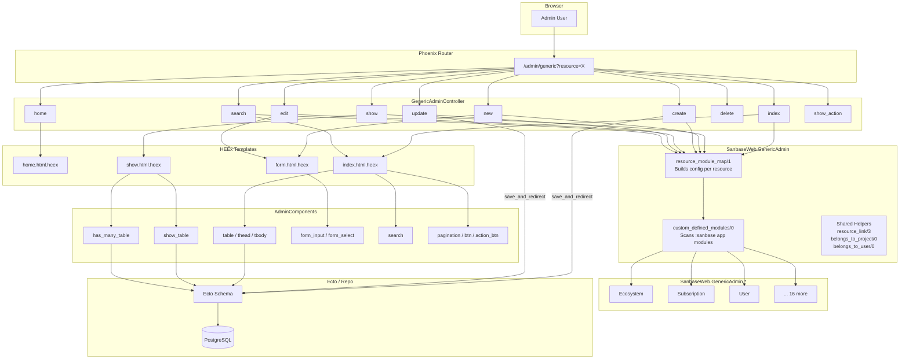
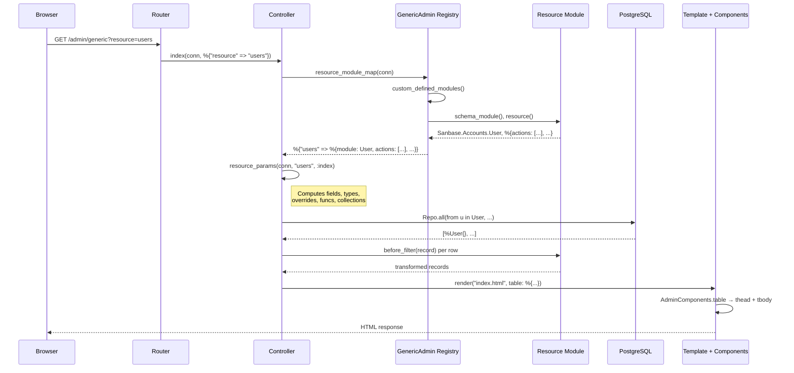
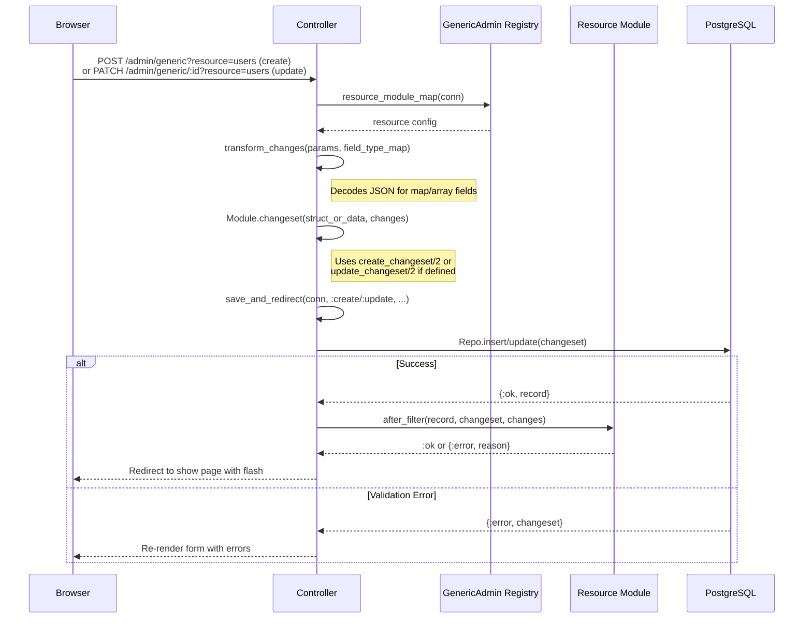

# GenericAdmin Architecture

The GenericAdmin framework provides a configuration-driven CRUD admin interface
for Ecto schemas that don't need custom LiveView pages.

## System Overview



## Request Flow



## Create/Update Flow



## Resource Module Configuration

```mermaid
classDiagram
    class ResourceModule {
        +schema_module() :: module
        +resource_name() :: String.t [optional]
        +resource() :: map [optional]
        +before_filter(record) :: record [optional]
        +after_filter(record, changeset, changes) [optional]
        +has_many(record) :: list [optional]
        +belongs_to(record) :: list [optional]
    }

    class ResourceConfig {
        module : Ecto schema module
        admin_module : GenericAdmin.* module
        singular : String.t
        actions : [:show, :new, :edit, :delete]
        index_fields : :all | [atom]
        new_fields : [atom]
        edit_fields : [atom]
        preloads : [atom]
        fields_override : map
        belongs_to_fields : map
        custom_index_actions : list
        funcs : map
    }

    class FieldOverride {
        value_modifier : (record -> any)
        collection : [{label, value}]
        type : atom
        search_query : Ecto.Query
    }

    class BelongsToField {
        query : Ecto.Query
        transform : (rows -> [{label, value}])
        resource : String.t
        search_fields : [atom]
    }

    ResourceModule --> ResourceConfig : produces via resource/0
    ResourceConfig --> FieldOverride : fields_override values
    ResourceConfig --> BelongsToField : belongs_to_fields values
```

## File Structure

```
lib/sanbase_web/
├── generic_admin.ex                          # Registry + shared helpers
├── generic_admin/
│   ├── ARCHITECTURE.md                       # This file
│   ├── ecosystem.ex                          # Resource: Ecosystem
│   ├── subscription.ex                       # Resource: Subscription, Plan, Product, PromoTrial
│   ├── user.ex                               # Resource: User
│   ├── project.ex                            # Resource: Project + related
│   ├── post.ex                               # Resource: Post
│   ├── ... (19 resource modules total)
│   └── version.ex                            # Resource: Version
├── controllers/
│   └── generic_admin_controller.ex           # CRUD controller + LinkBuilder
├── components/admin/
│   └── admin_components.ex                   # Phoenix function components
└── templates/generic_admin_html/
    ├── home.html.heex                        # Admin home / navigation
    ├── index.html.heex                       # Resource listing (search + table)
    ├── show.html.heex                        # Resource detail (show_table + has_many)
    └── form.html.heex                        # Unified new/edit form
```
