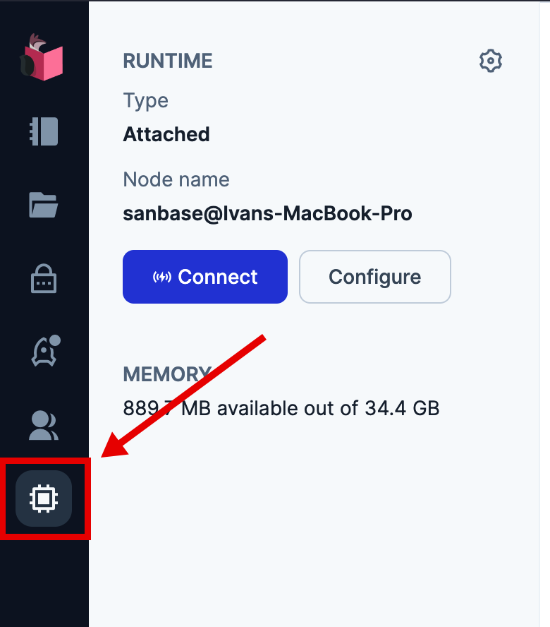
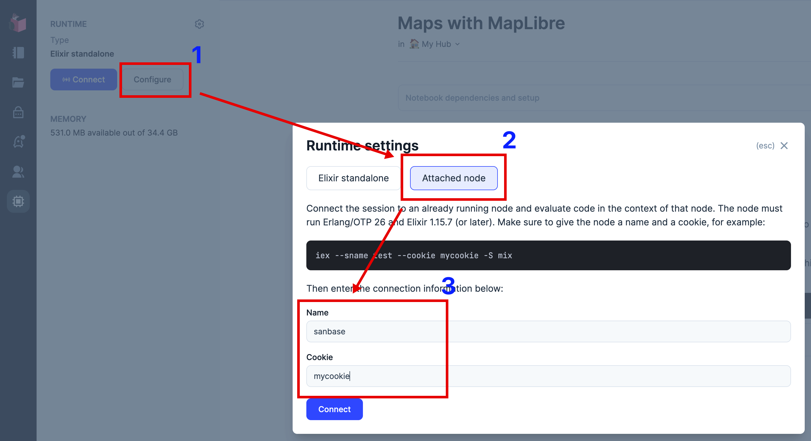

# LiveBook for local development

During local development cycles, the need for executing the same sequence of functions arises often.
While running mix with the Erlang flang to keep history is useful, it is not very friendly when
the command is further back in the history, is consising of multiple lines, or it is just too long of a sequence.

To help this, we connect Livebook to a locally running sanbase application.

## Connect LiveBook to a local node

1. Run sanbase with --sname and --cookie flags. I personally add the following alias to my ~/.zshrc file.
Feel free to change the sname and cookies.
```sh
alias imps='iex --cookie mycookie --sname sanbase --erl "-kernel shell_history enabled" -S mix phx.server'
```
2. Run LiveBook
3. Open a notebook or create an empty notebook.
4. Navigate to Runtime Settings by clicking the button or pressing `sr`.

5. Click Configure->Attached node and enter the sname and cookie details.

6. Now you are connected to the OTP app and can run any code against it.
> Note: The `.iex.exs` file is not imported, so no aliases are predefined. You need to use
> the full module names.
